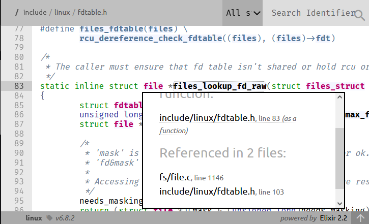
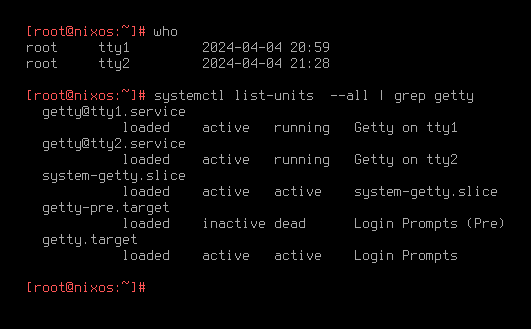
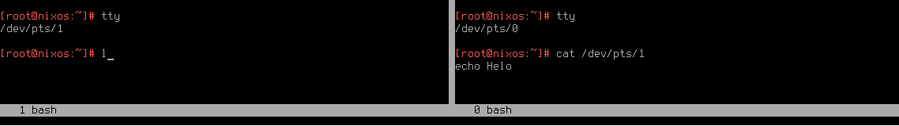
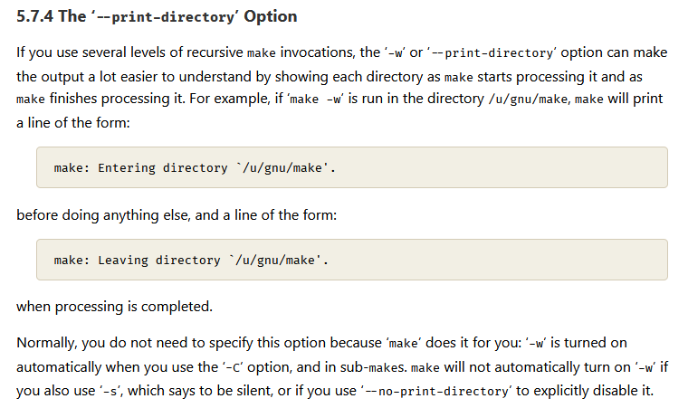

# Make or Break Standard I/O

Sometimes, while working on complex code bases that are executed in UNIX systems, we need to have different processes communicate with each other.
This approach is broadly called inter-process communication (IPC), and there are many similar but different ways in which this can be achieved.
The most basic one is using standard input/output (stdio) to set up such communication.
In this article we shall take a deep-dive into this approach hoping to demystify it.

For it to be at least somewhat practical, we provide some snippets and tips at the end of this article.
An additional practical benefit of this article is that we use Zig code snippets in this article to illustrate the concepts.
If you always were interested in what this language looks like and how to work with it, this article is for you.

## Files!

If there was a UNIX musical ever made, in the tradition of punchy single-word musical names, it would be called "Files!".
There is an old adage that everything in UNIX is a file.
It holds true for stdio, even though the three stdio files are device files, not regular files!
We shall touch on this down the line.

In Linux, every process has a data structure called `files_struct`, which holds `fdtable`, which provides a low-level interface to all the file descriptors currently associated with said process.

```C
/*
 * The caller must ensure that fd table isn't shared or hold rcu or file lock
 */
static inline struct file *files_lookup_fd_raw(struct files_struct *files, unsigned int fd)
{
	struct fdtable *fdt = rcu_dereference_raw(files->fdt);
	unsigned long mask = array_index_mask_nospec(fd, fdt->max_fds);
	struct file *needs_masking;

	/*
	 * 'mask' is zero for an out-of-bounds fd, all ones for ok.
	 * 'fd&mask' is 'fd' for ok, or 0 for out of bounds.
	 *
	 * Accessing fdt->fd[0] is ok, but needs masking of the result.
	 */
	needs_masking = rcu_dereference_raw(fdt->fd[fd&mask]);
	return (struct file *)(mask & (unsigned long)needs_masking);
}
```
_Low-level file descriptor lookup. `include/linux/fdtable.h`, Kernel v6.8.2._

Note that it stores the descriptors of all the files, not just the open ones.
Kernel routines can verify if a file is open by calling `fd_is_open(unsigned int fd, const struct fdtable *fdt)` on a given file descriptor table.

> Hint! If you want to easily look up and cross-reference identifiers in Linux kernel, you can use Bootlin cross-referencer, hosted over at https://elixir.bootlin.com/linux/v6.8.2/source.



Processes are forked with `sys_clone()`, which is a generic process forking routine.
It is a macro-wrapper around `kernel_clone()`, which eventually copies all the file descriptors from the parent proces in the most intricate `copy_process()`.
It happens after tracer setup, and only after the descriptors are copied, the information about the newly forked process is relayed to the scheduler.

The function that performs the copying of the `files_struct` is `copy_files()` and it will do what it says on the tin unless clone argument `no_files` is set (see struct `kernel_clone_args` defined in `sched/task.h`).

To illustrate the semantics of `copy_files()`, let's have a look at the following Zig code:

```zig
const std = @import("std");

pub fn main() !void {
    const message = "Hello, world!\n";

    // Write and create
    const flags = std.os.O.WRONLY | std.os.O.CREAT;
    const fd = try std.os.open("./output.txt", flags, 0o644);

    const pid = try std.os.fork();

    if (pid == 0) {
        std.os.nanosleep(0, 100_000_000);
        std.debug.print("[CHILD] Attempting to write to fd.\n", .{});
        try fds("CHILD");
        // This write will happen because file descriptors are duplicated independently
        // even though we shall close the file descriptor corresponding to `output.txt`
        // shall be closed by the parent process immediately after forking.
        //
        // A system call similar to `dup2()` is used.
        // 
        // `dup2()` makes susre that the integer associated with the file descriptor 
        // is preserved after dupplication.
        // For stdio, it ensures that STDIN shall be 0, STDOUT -- 1, etc.
        const result = try std.os.write(fd, message);
        if (result != message.len) {
            std.debug.print("[CHILD] Failed to write to fd.\n", .{});
            std.os.exit(1);
        } else {
            std.debug.print("[CHILD] We do what we must because we can.\n", .{});
            std.os.exit(0);
        }
    } else {
        std.debug.print("[PARENT] Closing fd immediately.\n", .{});
        // Close fd immediately from the parent.
        std.os.close(fd);
        try fds("PARENT");

        const wpr = std.os.waitpid(pid, 0x00000000); // Wait for child process to exit

        // Check if the child exited with an error due to closed STDIN
        if (std.os.W.IFEXITED(wpr.status) and std.os.W.EXITSTATUS(wpr.status) == 0) {
            std.debug.print("[PARENT] This was a triumph.\n", .{});
        }
    }
}

// Dummy function to print active file descriptors, ignore for the time being
pub fn fds(_: [*:0]const u8) !void {}
```

You see that we fork a process here and let the parent process close `output.txt` by waiting in the child for 100 milliseconds.
As we described above, the files are copied to the child at fork time, so it doesn't matter that the file is closed by parent.
The child has the copied file "alive", so `fd` resolves to an open file in `files_struct`.

To illustrate this point further, we would like to query `files_struct`, but to my knowledge we can't do it with `libc` facilities or otherwise.
We can, however, get the information about the file descriptors tracked by kernel by querying `/proc/self/fd`. 
Let's implement the dummy `fds` function from the previous example.

```zig
pub fn fds(whose: [*:0]const u8) !void {
    var dir = try std.fs.openIterableDirAbsolute("/proc/self/fd", .{});
    defer dir.close();

    var it = dir.iterate();
    while (try it.next()) |entry| {
        if (entry.kind == .sym_link) {
            var resolved_path: [std.fs.MAX_PATH_BYTES]u8 = undefined;
            const sl_resolved_path = try std.os.readlinkat(dir.dir.fd, entry.name, &resolved_path);
            std.debug.print("[{s}] FD {s}: {s}\n", .{ whose, entry.name, sl_resolved_path });
        }
    }
}
```

As we run this in a clean terminal, we get output that confirms that `output.txt` was, indeed, closed from the parent process.

```
λ zig build run-01B-fd-forward && cat output.txt
[PARENT] Closing fd immediately.
[PARENT] FD 0: /dev/pts/19
[PARENT] FD 1: /dev/pts/19
[PARENT] FD 2: /dev/pts/19
[PARENT] FD 3: /proc/455/fd
[CHILD] Attempting to write to fd.
[CHILD] FD 0: /dev/pts/19
[CHILD] FD 1: /dev/pts/19
[CHILD] FD 2: /dev/pts/19
[CHILD] FD 3: /home/sweater/flake-mag/001/01/output.txt
[CHILD] FD 4: /proc/456/fd
[CHILD] We do what we must because we can.
[PARENT] This was a triumph.
Hello, world!
```

In the snippet above we have demonstrated how to make use of the standard low level functions to open and close files.
Now let's demonstrate that the same functions can be used to work with stdio files.
As well as that, let's demonstrate that indeed if a file, even one of stdio files, is closed, it won't be copied by Linux kernel to the forked process.

```zig
pub fn main() !void {
    try fds("PARENT_BEFORE");
    // Close standard file descriptors
    std.os.close(0);
    try fds("PARENT_NO_STDIN");
    std.os.close(1);
    try fds("PARENT_NO_STDOUT");
    // std.os.close(2); // Leave STDERR open for debugging

    const pid = try std.os.fork();

    if (pid == 0) {
        try fds("CHILD");
        const stdin_fd = 0; // STDIN file descriptor
        var buf = [_:1]u8{0};
        std.debug.print("[CHILD] Attempting to read from STDIN...\n", .{});
        _ = std.os.read(stdin_fd, &buf) catch std.os.exit(1);
        std.debug.print("[CHILD] Read from STDIN: {s}\n", .{buf});
        std.os.exit(0);
    } else {
        try fds("PARENT_AFTER");
        const wpr = std.os.waitpid(pid, 0x00000000); // Wait for child process to exit

        // Check if the child exited with an error due to closed STDIN
        if (std.os.W.IFEXITED(wpr.status) and std.os.W.EXITSTATUS(wpr.status) == 1) {
            std.debug.print("[PARENT] Child process confirmed that STDIN is closed.\n", .{});
        } else {
            std.debug.print("[PARENT] Child process did not behave as expected.\n", .{});
        }
    }
}
```
_This code uses `fds` function just like in the previous example._

When you inspect the output of this command, note that file descriptor 0 is allocated to `/proc/26202/fd` due to us opening a file descriptor in `fds` function.
The first unused file descriptor shall be used.
In this case, since we closed STDIN, it is `0`.
If you were wondering if closing stdio files is a good idea, I hope that this curious side effect shall be enough to convince you that it isn't a good idea indeed.

```
λ zig build run-01A-closed-stdio
[PARENT_BEFORE] FD 0: /dev/pts/19
[PARENT_BEFORE] FD 1: /dev/pts/19
[PARENT_BEFORE] FD 2: /dev/pts/19
[PARENT_BEFORE] FD 3: /proc/26202/fd
[PARENT_NO_STDIN] FD 0: /proc/26202/fd
[PARENT_NO_STDIN] FD 1: /dev/pts/19
[PARENT_NO_STDIN] FD 2: /dev/pts/19
[PARENT_NO_STDOUT] FD 0: /proc/26202/fd
[PARENT_NO_STDOUT] FD 2: /dev/pts/19
[PARENT_AFTER] FD 0: /proc/26202/fd
[PARENT_AFTER] FD 2: /dev/pts/19
[CHILD] FD 0: /proc/26203/fd
[CHILD] FD 2: /dev/pts/19
[CHILD] Attempting to read from STDIN...
[PARENT] Child process confirmed that STDIN is closed.
```


You can see that file descriptors 0, 1, and 2 are set both for parent and the child.
Of course, most, if not all, the materials online on `stdio` will tell you that these are three special files that get passed from parent to child.
But if we look at the process initiation code or, in fact, aforementioned `copy_files` function, we will see that there is no special treatment of any files in `files_struct` whatsoever!

```C
static int copy_files(unsigned long clone_flags, struct task_struct *tsk,
		      int no_files)
{
	struct files_struct *oldf, *newf;
	int error = 0;

	/*
	 * A background process may not have any files ...
	 */
	oldf = current->files;
	if (!oldf)
		goto out;

	if (no_files) {
		tsk->files = NULL;
		goto out;
	}

	if (clone_flags & CLONE_FILES) {
		atomic_inc(&oldf->count);
		goto out;
	}

	newf = dup_fd(oldf, NR_OPEN_MAX, &error);
	if (!newf)
		goto out;

	tsk->files = newf;
	error = 0;
out:
	return error;
}
```
_Routine that copies files in the kernel doesn't have any special treatment for stdio. `kernel/fork.c`, Kernel 6.8.2._

As a matter of fact, we can scour the entirety of kernel codebase responsible for files and processes for stdio-related stuff, we will find naught.

In the following section, we discuss how stdio files actually come into existence.

## From Whence You Came


The earliest place where we find our elusive stdio files is `console_on_rootfs()` function.
As the kernel gets unpacked (`head.S` -> `start_kernel` -> `...`), a file `/dev/console` gets populated by initramfs.
Afterwards, this file gets multiplexed into three file descriptors and an early console driver will use it to organise its stdio.

```
/* Open /dev/console, for stdin/stdout/stderr, this should never fail */
void __init console_on_rootfs(void)
{
	struct file *file = filp_open("/dev/console", O_RDWR, 0);

	if (IS_ERR(file)) {
		pr_err("Warning: unable to open an initial console.\n");
		return;
	}
	init_dup(file);
	init_dup(file);
	init_dup(file);
	fput(file);
}
```
_Early console is the first place where stdio appears during Linux boot process. `init/main.c`, Kernel 6.8.2._

> Note! While normally stdio is populated using `dup2()` system call, early console setup does it differently.
> It uses a custom file descriptor duplication technique to prevent race conditions.
> Under the hood, it uses read-copy-update (RCU) synchronization mechanism which:
> 1. Removes the pointer to the early file descriptor table, preventing new read attempts.
> 2. Waits for its readers to complete critical sections of working with the data behind the original pointer.
> 3. Frees (or otherwise rearranges) memory section after all the existing readers reported that their critical sections are completed.
>
> A good example of RCU strategy from daily computer use would be the way Firefox browser forces restart after upgrade.
> It lets the user finish their work in the existing tabs, but shan't allow a new tab to be opened, prompting browser restart.

## Streams of the Multitudes

Looking at the code snippets, you may already understand how does it happen that standard input-outputs of various programs don't cross-pollute.
Let's discuss it with more precision, however. 

First of all, we should be clear that `/dev/console` file we have seen and, indeed, the `/dev/pts/19` file we have seen, aren't regular files like a text file.

> Note! The letters `pt` in `pts` stand for "pseudo-terminal", and `s` stands for an archaic word meaning "secondary".
> Pseudo-terminals shouldn't be confused with virtual terminals!
> A virtual terminal is an emulator of a hardware terminal in software.
> Linux without graphical server running such as `wayland` or `X11` creates a bunch of consoles that are connected to their own virtual terminal via `/dev/tty{0,1,...}` devices.
> Pt-main and pt-secondary (named differently in Linux Kernel) are acquired via `openpty()` call from `libc`.
> Virtual terminals are created with `getty()` call from the kernel.



Linux kernel defines many file kinds, confirming what we said in the introduction that "everything is a file" adage is less nuanced than the reality.
Here are the kinds of files:
- Block device: your hard drives and other possible devices that stored data in fixed-size blocks. These normally provide random access.
- Character device: your keyboards, mice, serial ports. Devices that emit and consume data byte-by-byte. Random access is rare.
- Directory: a file that only can refer to other files. That's the most elegant way to conceptually define directories.
- Named pipe: unidirectional data flow and operates on a first-in-first-out basis. Unlike regular files, it doesn't store data persistently; it simply passes it from the writer to the reader. Anonymous pipes are created with `|`, but you can make a named pipe with `mkfifo`.
- Symlink: a file that contains exactly one reference to another file. Can be thought of as a "shortcut".
- File: a byte-aligned file holding some data. This kind of file is what people imagine when you say "a file". Hence the name.
- UNIX domain socket: a socket that behaves like a TCP/IP socket, except is using file system for data transfer.

Based on the descriptions of the file kinds above, you can guess what sort of files are stored in `/dev/pts`, but let's verify it:

```zig
const std = @import("std");

pub fn print_kinds(from: []const u8) !void {
    var dir = try std.fs.openIterableDirAbsolute(from, .{});
    defer dir.close();

    var it = dir.iterate();
    while (try it.next()) |entry| {
        // Switch on entry.kind
        switch (entry.kind) {
            .block_device => std.debug.print("block device: {s}\n", .{entry.name}),
            .character_device => std.debug.print("character device: {s}\n", .{entry.name}),
            .directory => std.debug.print("directory: {s}\n", .{entry.name}),
            .named_pipe => std.debug.print("named pipe: {s}\n", .{entry.name}),
            .sym_link => std.debug.print("sym link: {s}\n", .{entry.name}),
            .file => std.debug.print("file: {s}\n", .{entry.name}),
            .unknown => std.debug.print("unknown: {s}\n", .{entry.name}),
            else => std.debug.print("non-linux: {s}\n", .{entry.name}),
        }
    }
}

pub fn main() !void {
    try print_kinds("/dev/pts");
}
```
_A zig program that prints the kinds of the files in a given directory._

The output of this program is as follows:

```
character device: 0
character device: 2
character device: 1
character device: ptmx
```
_An output of `try print_kinds("/dev/pts")`._

Surprisingly, we have discovered `ptmx` character device. 
We won't get into many details about its inner workings in this article, but we will explain what is the idea behind it.
Root-owned `ptmx` (pseudo-terminal multiplexer) is the key to how pseudo-terminal devices are created.

```
crw--w---- 1 sweater tty  136,  0 Apr  4 21:46 0
crw--w---- 1 sweater tty  136,  1 Apr  1 03:38 1
crw--w---- 1 sweater tty  136,  2 Apr  1 03:38 2
c--------- 1 root    root   5,  2 Mar 31 06:32 ptmx
```
_An output of `ls -la /dev/pts`._

For your terminal emulator to work, it needs a PTM device and a PTS device.
Main pseudo-terminal device has no path attached to it and is used for coordination of the terminal state via I/O operations.
It also is solely responsible for orchestration of session management.

Secondary pseudo-terminal device is a file linked directly to the terminal emulator's frontend.
Writing into it causes input to be relayed to PTM and normally displayed on screen.

Some time ago, users of Linux kernel could just make PTM/PTS pairs ad hoc.
However, as the amount of objects flying around in `/dev` grew, a necessity appeared to centralised the task of giving out PTM/PTS pairs.
This is how `ptmx` was conceived.
System calls perform I/O on `ptmx` to have Linux Kernel create a PTM/PTS pair and return it for use of the process.

Because PTS is merely an I/O orchestration tool which doesn't actually store any data, the following properties hold true for it:

 1. You can't assume to be able to seek stdio, once you flush bytes into a stdio file, they generally can only be sequentially consumed by a reader.
 2. One does not simply attache to a pts device file or to a tty file in hopes to be able to read stdio contents. It is a device file the role of which is to perform side effects.

As a matter of fact, you can conduct the following experiment:

 1. Get PTS device number of your pseudo-terminal by running `tty`.
 2. Start reading from it from another terminal with `cat /dev/pts/$pts_id`
 3. Try typing `echo Hello` into the first pseudo-terminal.

What you will observe is that your keypresses are *either* consumed by `cat` *or* displayed in your terminal emulator because keypress got through to PTM, which resulted in characters being drawn on the screen via PTS, but not both at the same time.
I don't know if you find it to be a funny prank, but the behaviour of the active console is sure confusing.



As you can see in the code of your favourite terminal emulator, a pair of PTM and PTS is obtained via an `openpty(&main, &secondary, ...)`.
Then, the PTS component of this pair shall be exactly the file which is going to be duplicated with `dup2` and serve as *the* stdio file, serving both STDIN, STDOUT and STDERR.

```C
int
ttynew(const char *line, char *cmd, const char *out, char **args)
{
    int m, s;

    if (out) {
        term.mode |= MODE_PRINT;
        iofd = (!strcmp(out, "-")) ?
              1 : open(out, O_WRONLY | O_CREAT, 0666);
        if (iofd < 0) {
            fprintf(stderr, "Error opening %s:%s\n",
                out, strerror(errno));
        }
    }

    if (line) {
        if ((cmdfd = open(line, O_RDWR)) < 0)
            die("open line '%s' failed: %s\n",
                line, strerror(errno));
        dup2(cmdfd, 0);
        stty(args);
        return cmdfd;
    }

    /* seems to work fine on linux, openbsd and freebsd */
    if (openpty(&m, &s, NULL, NULL, NULL) < 0)
        die("openpty failed: %s\n", strerror(errno));

    switch (pid = fork()) {
    case -1:
        die("fork failed: %s\n", strerror(errno));
        break;
    case 0:
        close(iofd);
        close(m);
        setsid(); /* create a new process group */
        dup2(s, 0);
        dup2(s, 1);
        dup2(s, 2);
        if (ioctl(s, TIOCSCTTY, NULL) < 0)
            die("ioctl TIOCSCTTY failed: %s\n", strerror(errno));
        if (s > 2)
            close(s);
#ifdef __OpenBSD__
        if (pledge("stdio getpw proc exec", NULL) == -1)
            die("pledge\n");
#endif
        execsh(cmd, args);
        break;
    default:
#ifdef __OpenBSD__
        if (pledge("stdio rpath tty proc", NULL) == -1)
            die("pledge\n");
#endif
        close(s);
        cmdfd = m;
        signal(SIGCHLD, sigchld);
        break;
    }
    return cmdfd;
}
```
_Stdio in suckless terminal. `st.c`, st 0.9._

## Doppelgang Paradox

We already learned that it doesn't happen that three different device files are created for each entity in `stdio`.
But if it's the same file, how come they can be distinguished as data gets flushed into those?
Well, the short answer is that they can't be distinguished.
To a degree that even STDIN is opened with write permissions by default, which means you can write into it.
And indeed, when you write into STDIN, your terminal will behave in the same way as it would if you wrote into STDOUT or STDERR.
The three files, as far as your console is concerned, are truly doppelgangers.

```zig
const std = @import("std");

pub fn main() !void {
    _ = try std.os.write(0, "Hello, world!\n");
}
```
_This program will output "Hello, world!" in your terminal emulator._

However, since the meaning of STDIN being attached to PTS is to read user input, which is passed to PTS via PTM as a result of handling keypresses, this write shall be ignored and won't be read by the program shown in the next listing.
The forked child here shall terminate only after a user presses a key, which shall be relayed to it via STDIN.

```zig
const std = @import("std");

pub fn main() !void {
    const pid = try std.os.fork();

    if (pid == 0) {
        var buf = [_:255]u8{0};
        _ = try std.os.read(0, &buf);
        std.debug.print("Child read: {s}\n", .{buf});
    } else {
        std.os.nanosleep(0, 10_000);
        _ = try std.os.write(0, "Hello, world!\n");
    }
}
```
_Note that this program will crash if you pipe something into it, because the pipe won't be opened for writing!_

Thus, the only way to "un-dopplegang" stdio is to swap out some file descriptors.
The most common way to do so is by using pipes and redirections while invoking programs from a shell like `bash`.
Observe every stdio file being replaced in the following snippet.

```
λ ls -la /proc/self/fd <input.txt 2>output.err | tee output.txt
total 0
dr-x------ 2 sweater sweater  0 Apr  7 19:26 ./
dr-xr-xr-x 9 sweater sweater  0 Apr  7 19:26 ../
lr-x------ 1 sweater sweater 64 Apr  7 19:26 0 -> /tmp/input.txt
l-wx------ 1 sweater sweater 64 Apr  7 19:26 1 -> pipe:[3717804]
l-wx------ 1 sweater sweater 64 Apr  7 19:26 2 -> /tmp/output.err
lr-x------ 1 sweater sweater 64 Apr  7 19:26 3 -> /proc/19836/fd
```
_Input is a file, the output is piped, while stderr is recorded into a regular file. bash 5.0.7._

> Note! `tee` is a very useful program for situations when you need to have an interactive session, traces of which you want to preserve for a later review or further automated manipulation.
> It displays whatever it gets into STDIN into STDOUT, but also records that data into file.
> Use `tee -a` if you want to append to file without overwriting.

# Using stdio for IPC

In the beginning of this article, we have seen how to write our own software that interacts with stdio.
As was shown in the last example, you could use pipes (`|`) and redirections (`>` and even `<`) to swap out your PTS with another file while spawning processes from a shell.

Let's now have a look at some examples of using stdio for IPC both when it comes to commonly used commands and from our code.

## To pipe or not to pipe

While learning Linux or other UNIX systems, one of the first sequence of commands we get acquainted with is "something something pipe grep".
Very often, however, we want to just grep contents of some file for some string.
Writing it as `cat file.txt | grep string`, however, is wasteful in the amount of file descriptors created (not that it particularly matters).
Instead, with what we learned about stdio from this article, we can just write `grep string <file.txt`.
This will directly substitute file descriptor 0 with a descriptor pointing at `file.txt`.

## Input or argument

An important consideration to choose whether or not use CLI arguments or stdio is the amount of data you want to shove into those.
If those are simple strings, especially not something that needs escaping, using arguments is perfectly reasonable.
While you can do the same with command-line arguments too, if you escape them, as seen in the next example, it's a bad design because it introduces unnecessary fragility.

```
Sun Apr 07 00:27:32:244240400 sweater@conflagrate /tmp
λ export x=$(cat <<EOF
Multiline
File
Name.txt
EOF
)
Sun Apr 07 00:27:38:754602700 sweater@conflagrate /tmp
λ echo "$x"
Multiline
File
Name.txt
Sun Apr 07 00:27:41:467729600 sweater@conflagrate /tmp
λ echo "Hello World" > "$x"
Sun Apr 07 00:27:52:976430800 sweater@conflagrate /tmp
λ cat Multiline$'\n'File$'\n'Name.txt
Hello World
```
_Making a text file the name of which is a multiline string._

> Note! The snippet above uses here-document feature of bash.
> It is a type of input redirection which creates a regular temporary file, writes to it whatever is between _limit strings_ and redirects it into STDIN.
> After the redirection happens, the file gets deleted.
> For example, if you `<<` into `ls -la /proc/self/fd`, you will see an output akin to `0 -> '/tmp/sh-thd.myfoxY (deleted)'`.

Another reason to use STDIN to read "big" inputs is the flexibility it provides.
A tool that calls your program won't need to format its output in any particular way.
It may be relevant if, for instance, use JSON as to encode your IPC calls.
In the next example, the program that emits solution can emit multiline JSON, single-line JSON or even weirdly-formatted JSON and the communication won't break down.

```rust
pub fn main() {
    let arg_input = std::env::args().nth(1).expect("No input file provided");
    let solution_str = std::io::stdin()
        .lock()
        .lines()
        .next()
        .expect("No solution provided")
        .expect("Failed to read solution");
    let solution =
        Solution::new(serde_json::from_str(&solution_str).expect("Failed to parse solution"));

    let input = Input::from_json(&PathBuf::from(arg_input)).expect("Failed to read input file");
    let forest = generate_forest(input.clone(), solution.clone());
    let score = score_graph(&forest);

    println!("{}", score);
}
```

## Bending tools

If you need to run your commands from some programmable tool such as `make` or `npm`, normally you can bend those tools to your will.
Since normally command runners execute commands inside a shell, you can leverage `cat` from inside the recipe to forward STDIN where you need it to be forwared.

As a bit of foreshadowing, to maintain clean STDOUT, in your `make` recipes, you should prefix the commands you call from the recipes with `@`.
In our challenge of capturing STDIN, we prefix `cat`.

```make
check: target/release/checker
        @cat | ./target/release/checker $(input)
```

In case of `npm`, you may do something like this.

```json
"scripts": {
    "test": "echo \"Error: no test specified\" && exit 1",
    "cat": "cat | index.js"
},
```

## Bridge too Near

**TODO**: Some tools except to be attached to STDIN (for example, REPLs) and when STDIN ends they exit. For example, Elixir's `iex`.

## When make breaks

Even though IPC with stdio is the simplest way to ensure data communicating between different processes, it's not without risks when it comes to using third party tools in the pipeline.
We will finish this article with a recent bug that was plaguing our development team.

The system of interest for this example is a system which works with many binaries we have some control over, uses stdio for IPC.
We build and run various these binaries with Makefiles using standard recipe API.

All the tests worked, including the big end-to-end test.
However, when we would run the whole system in development mode or on staging, everything worked except for the execution pipelines involving `make`.
The latter would fail with no-parse error while trying to process the data emitted into STDOUT by the child process.

The problem was that we were running staging and development environments with another `make` recipe
The purpose of this recipe was to make sure that the environment is set up and then pop an interactive system shell.
The reason for this weird bug is twofold:

1. `make`, against all the best practices, is printing diagnostic messages into STDOUT.
2. When `make` runs another `make` under the hood, it starts printing diagnostic messages, even though it doesn't do it when it's invoked at the top level.



These two factors ended up in pollution of STDOUT, which resulted in underlying programs not being able to parse the output.
After we have pin-pointed the issue, the fix was simple.

```
λ git diff e019ee8dc0d1229a65c9fef11571d33bef5eb3a9
diff --git a/bakery/src/singleplayer.rs b/bakery/src/singleplayer.rs
index f133d1d..653f395 100644
--- a/bakery/src/singleplayer.rs
+++ b/bakery/src/singleplayer.rs
@@ -169,6 +169,7 @@ pub fn simple_singleplayer(
     // If everything is OK, run the checker
     if let Ok(run_output) = &submission_output.run_output {
         let mut checker_process = match Command::new("make")
+            .arg("--silent")
             .arg("check")
             .arg(format!("input={}", input.to_str().unwrap()))
             .current_dir(checker) // Set the current directory to the checker directory
```
_The final piece of advice we give you in this article is to always run `make` with `--silent` from your code!_

That's it for the inaugural article of the Flake Magazine.
We hope you enjoyed this deep-dive into stdio, and hopefully now you feel like you know both its ins and outs.
Some pun intended!
